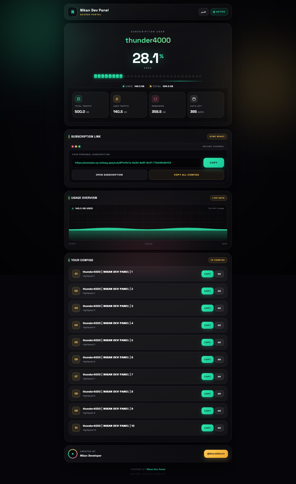

<p align="center">
  
</p>

<h1 align="center">Nikan Dev Panel</h1>

<p align="center">
  <b>A self-hosted panel for managing Xray / VLESS users, quotas and subscription links.</b>
</p>

<p align="center">
  <a href="https://github.com/NikanDeveloper36/NikanDeveloperPanel/releases/latest">
    
  </a>
  
  
  
  
</p>

<p align="center">
  <a href="#-quick-start">Quick Start</a> ·
  <a href="#-deployment">Deployment</a> ·
  <a href="#-configuration">Configuration</a> ·
  <a href="#-rest-api">API</a> ·
  <a href="#-فهرست-فارسی">فارسی</a>
</p>

---

## Overview

**Nikan Dev Panel** is a single-container web panel that bundles **Nginx**, **Xray-core** and a **Flask** application. It lets an administrator create and manage VPN users, track their traffic usage, and hand out per-user VLESS configurations and subscription URLs.

The end user never needs the admin panel — they open their own subscription link and get:

- live usage (total / used / remaining / days left)
- a copyable subscription URL for any client
- all 10 of their VLESS configs, individually copyable or as QR codes
- full **English / فارسی** interface toggle

Everything runs from **one port** (`8080` by default): Nginx fronts the Flask UI and reverse-proxies the Xray inbound.

| | |
|---|---|
| **Backend** | Flask 3, SQLite (`users.db`) |
| **Core** | Xray-core (VLESS + WebSocket + TLS) |
| **Frontend** | Hand-written HTML/CSS/JS, no build step |
| **Bot** | Optional Telegram bot (`pyTelegramBotAPI`) |
| **Packaging** | Docker (`python:3.10-slim` + Nginx + Xray) |



---

## Features

**Admin panel**
- Dashboard with active-user monitoring
- Full user management: add, edit, enable/disable, reset traffic, delete
- Per-user quota (`GB`), expiry (`days`), UUID and status
- Live online-users API (`/api/online_users`)
- Settings page: Telegram bot token/admin ID, admin credentials, panel options
- Dark, mobile-first UI with no horizontal overflow

**Subscription page** (`/sub/<uuid>`)
- Animated dark theme (emerald + gold), reduced-motion aware
- 30-segment usage meter with count-up numbers
- Live usage graph and usage meter
- Terminal-style subscription link box with one-tap copy
- Copy-all-configs (base64 payload) and per-config QR codes
- Automatic client detection — VPN clients receive raw base64, browsers get the HTML page

**Configs**
- 10 VLESS configurations per user (different paths / `ed` params)
- Config title format: `<username> | 𝗡𝗜𝗞𝗔𝗡 𝗗𝗘𝗩 𝗣𝗔𝗡𝗘ЛЬ | <n>`

---

## Project structure

```
NikanDeveloperPanel/
├── app.py                     # Flask app, Xray/Nginx config builder, Telegram bot
├── requirements.txt
├── Dockerfile
├── static/
│   └── nikan-logo.jpg
├── templates/
│   ├── login.html
│   ├── dashboard.html
│   ├── users.html
│   ├── settings.html
│   └── subscription.html
└── docs/
    └── subscription-preview.png
```

Runtime files (`users.db`, `xray_config.json`, `nginx.conf`, `panel_settings.json`) are generated on first start and are git-ignored.

---

## Quick Start

### Docker (recommended)

```bash
git clone https://github.com/NikanDeveloper36/NikanDeveloperPanel.git
cd NikanDeveloperPanel

docker build -t nikan-dev-panel .
docker run -d --name nikan-panel \
  -p 8080:8080 \
  -e SECRET_KEY="change-me" \
  -e ADMIN_USER="admin" \
  -e ADMIN_PASS="strong-password" \
  nikan-dev-panel
```

Then open `http://localhost:8080`.

### Local development

```bash
pip install -r requirements.txt
python app.py
```

> Xray and Nginx are optional locally — the panel UI works without them; the core is only required to actually serve traffic.

---

## Configuration

All settings are environment variables:

| Variable | Default | Description |
|---|---|---|
| `PORT` | `8080` | Public port served by Nginx |
| `SECRET_KEY` | `nikan-dev-panel-secret-key-change-me` | Flask session secret — **always change in production** |
| `ADMIN_USER` | `admin` | Initial admin username |
| `ADMIN_PASS` | `admin` | Initial admin password — **always change in production** |

Internal (fixed) ports: Nginx `PORT` → Xray inbound `10000`, Xray API `10085`, Flask `5000`.

Admin credentials can also be changed from the **Settings** page after first login.

---

## Deployment

### Railway

1. Fork this repository.
2. In Railway → **New Project → Deploy from GitHub repo** → select your fork.
3. Add the environment variables above.
4. Deploy. Railway gives you a public URL.
5. Map a custom domain with TLS if you want `wss://` endpoints.

### Any Docker host

```bash
docker run -d -p 8080:8080 \
  -e SECRET_KEY="..." -e ADMIN_USER="..." -e ADMIN_PASS="..." \
  nikan-dev-panel
```

Works the same on a VPS, Hetzner, DigitalOcean, or Docker Compose.

---

## REST API

All admin APIs require an authenticated session (`POST /login`).

| Method | Route | Purpose |
|---|---|---|
| `GET` | `/` | Landing / redirect |
| `GET/POST` | `/login` | Admin login |
| `GET` | `/logout` | End session |
| `GET` | `/dashboard` | Dashboard |
| `GET` | `/users` | User management |
| `GET` | `/settings` | Settings |
| `GET` | `/api/online_users` | Currently connected users |
| `POST` | `/api/settings` | Update panel settings |
| `POST` | `/api/add_user` | Create a user |
| `POST` | `/api/edit_user/<id>` | Edit a user |
| `POST` | `/api/reset_user/<id>` | Reset traffic counter |
| `POST` | `/api/toggle_user/<id>` | Enable / disable |
| `POST` | `/api/delete_user/<id>` | Delete a user |
| `GET` | `/api/user_config/<id>` | Fetch one user's configs |
| `GET` | `/sub/<user_uuid>` | Public subscription page (HTML) or base64 payload for VPN clients |

---

## Security notes

- Set a strong `SECRET_KEY`, `ADMIN_USER` and `ADMIN_PASS` before exposing the panel.
- Keep `/login` behind HTTPS (Nginx already terminates TLS for the Xray inbound).
- The subscription URL contains a UUID — treat it like a password and never publish it.
- SQLite database and generated configs live next to the app; back them up, don't commit them.

---

## نسخه فارسی

**Nikan Dev Panel** یک پنل میزبانی‌شدهٔ تک‌دیترین است که **Nginx**، **Xray-core** و یک اپلیکیشن **Flask** را کنار هم قرار می‌دهد. مدیر می‌تواند کاربر بسازد، حجم مصرفی را دنبال کند و لینک اشتراک و کانفیگ‌های VLESS را به هر کاربر بدهد.

**سریع‌ترین راه‌اندازی:**

```bash
git clone https://github.com/NikanDeveloper36/NikanDeveloperPanel.git
cd NikanDeveloperPanel
docker build -t nikan-dev-panel .
docker run -d -p 8080:8080 \
  -e SECRET_KEY="..." -e ADMIN_USER="admin" -e ADMIN_PASS="..." \
  nikan-dev-panel
```

**قابلیت‌ها:**
- داشبورد مدرن و واکنش‌گرا (Mobile First)
- مدیریت کامل کاربران: افزودن، ویرایش، فعال/غیرفعال، ریست حجم، حذف
- نمایش حجم کل، مصرف‌شده، باقی‌مانده، درصد و روزهای انقضا
- صفحهٔ اشتراک با انیمیشن و پشتیبانی از **فارسی / English**
- ۱۰ کانفیگ VLESS برای هر کاربر + کپی سریع و QR
- تشخیص خودکار کلاینت (کلاینت‌های VPN کانفیگ خام base64 می‌گیرند)
- ربات تلگرام اختیاری برای مدیریت

**متغیرهای محیطی:** `PORT`، `SECRET_KEY`، `ADMIN_USER`، `ADMIN_PASS`

ساخته شده توسط [@NeuralDevvv](https://t.me/NeuralDevvv)

---

## Credits

Created by **Nikan Developer** — [@NeuralDevvv](https://t.me/NeuralDevvv)

Built with [Flask](https://flask.palletsprojects.com/), [Xray-core](https://github.com/XTLS/Xray-core) and [Nginx](https://nginx.org/).

If this project helps you, consider giving it a ⭐ on [GitHub](https://github.com/NikanDeveloper36/NikanDeveloperPanel).
